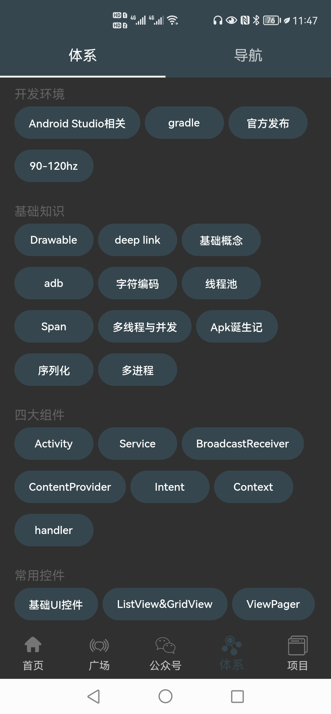

# Flutter 版 玩安卓 客户端

## 前言

> 项目是学习Flutter的练手项目，API皆来自[玩安卓](https://www.wanandroid.com/blog/show/2)

> 学习 `Flutter` 的过程中，收集了一些很好的学习网站以及插件，以及看了很多开发者的开源项目，学到了很多，在此感谢各位。

#### Flutter 学习资源
- [GSY的Flutter书籍GitBook版](https://guoshuyu.cn/home/wx/Flutter-1.html)
- [JSON转Dart](https://jsontodart.com/)
- [Dart仓库](https://pub.dev/)
- [小包子博客](https://xbzweb.com/)：提供了很多轮子及新颖的效果
- [Flutter中文网](https://flutterchina.club/)

## 项目截图

|  |  |  |  |
| --- | --- | --- | --- |
|  |  |  |  |
|  |  |  |  |
|  |  |  |  |

## 体验
    - 暂时不支持下载~，可以 `clone` 源码编译运行在 `iOS/Android` 设备上。

## 主要功能

- 首页、知识体系、公众号、导航、项目五大模块；
- 登录注册功能；
- 搜索功能：热门搜索、搜索历史；
- 收藏功能：添加收藏、取消收藏；
- 文章列表快速置顶功能；
- 浏览文章、分享文章、用浏览器打开文章；
- 我的积分、积分排行榜功能；
- 夜间模式功能；
- 自定义切换主题颜色功能；

## 学习过的开源项目
- [flutter_wanandroid](https://github.com/iceCola7/flutter_wanandroid/pulls)
- [仿京东](https://github.com/DiscoverForever/learn_flutter)
- [阿里巴巴项目 flutter-go](https://github.com/alibaba/flutter-go)
